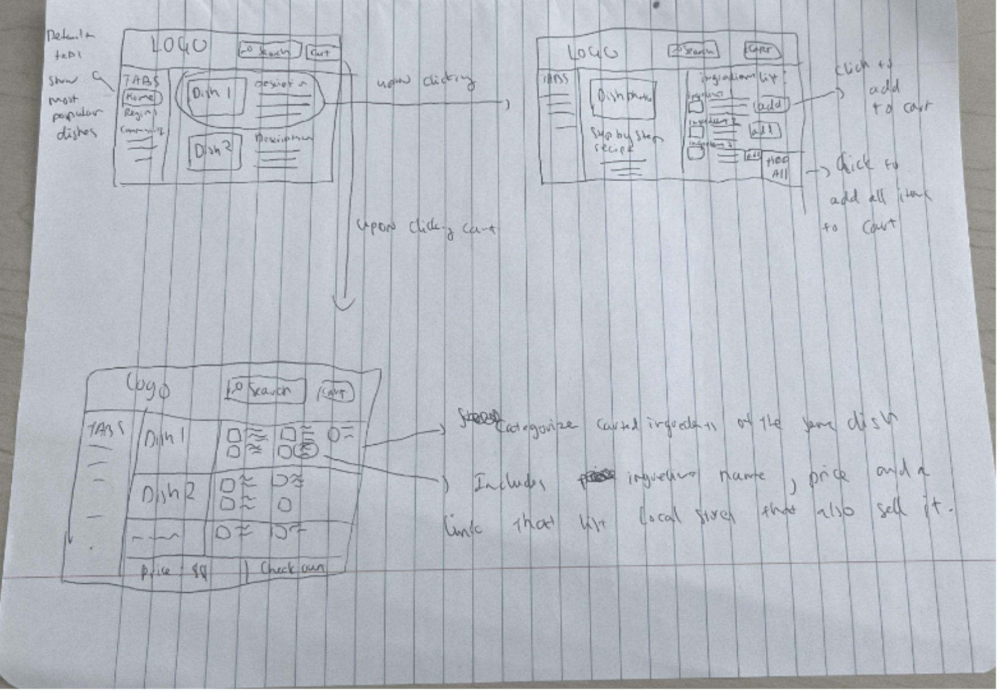
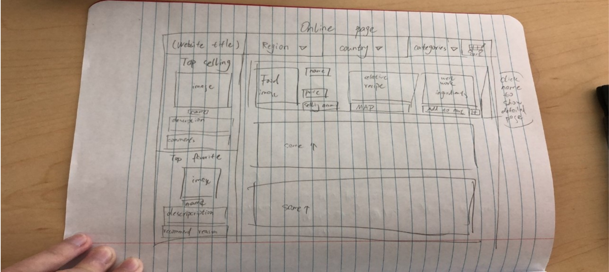
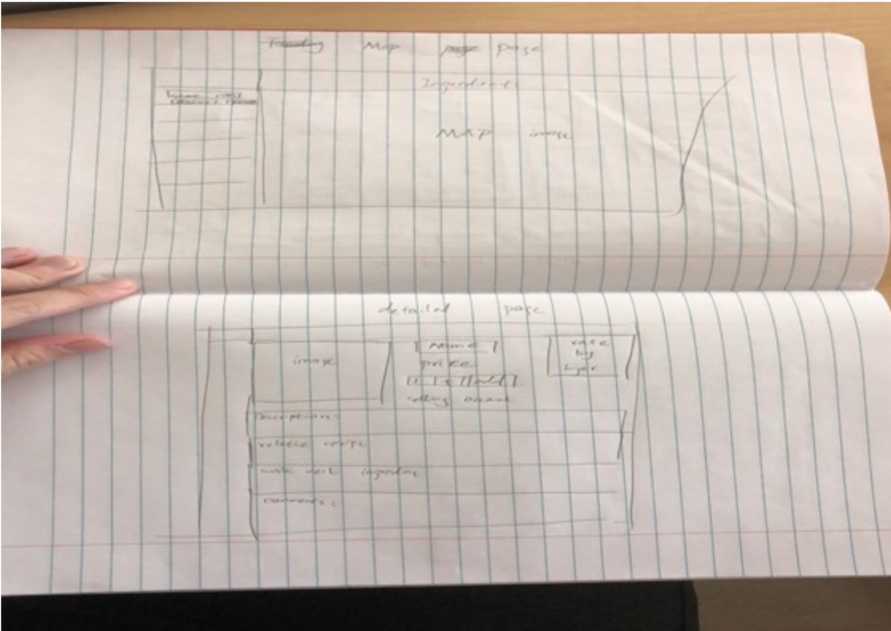
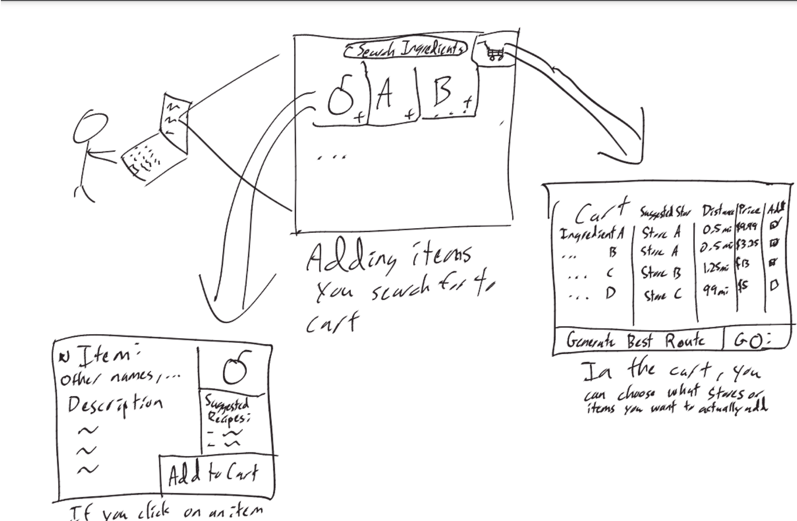
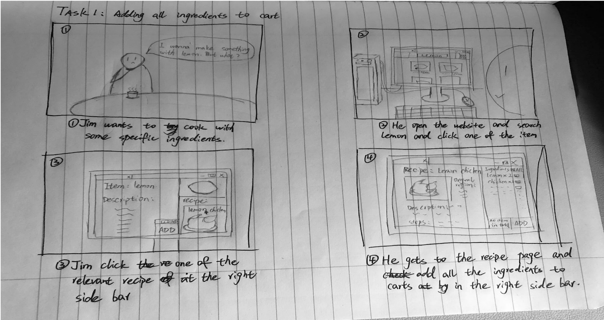
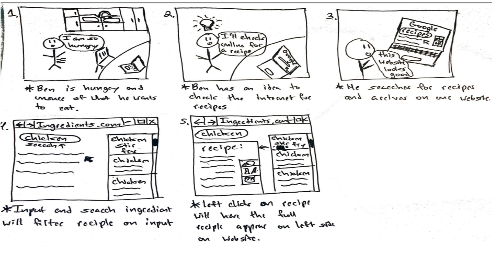

# Part 2 Report and Presentation

## Report

### Problem and Solution Overview: 
As America continues to see a growing number of immigrants and an increasing population of ethnic communities there is no denying their impact on American culture. These groups often continue to practice cooking based on traditional recipes and often find it difficult to procure ingredients needed for these recipes. Local ethnic based restaurants are one option but often the cost is too much and missing that authentic taste. Smaller family-owned ethnic stores are often only based in their respected community which for many are not close by. To tackle this problem our group decided to create a website based on two ideas. Idea one focused on the procurement of ingredients through direct purchase through the website. The second one shows local stores with that ingredient in stock and their distance to the user. 

### Design Research Goals, Stakeholders, and Participants:

The goal of our project is to help ethnic individuals in the Metro East area search for ingredients used in cultural recipes. Our research will be focused on how difficult it is to find specific ingredients used in ethnic cuisine. For many it is all too common to be disappointed when trying to replicate traditional ethnic recipes due to the difficulty of acquiring the correct ingredients. By being a part of the SIUE community we plan to utilize the growing and established international student presence. Our two established methods of user research will be in-person interviews along with an online survey asking similar questions. One approach to utilize the online survey would be sharing it within the numerous student discord groups along with having a QR code to share the survey. For in-person interviews we plan to utilize the SIUE campus in finding international or ethnic students and staff willing to participate.

Our group decided to conduct research using offline interviews and online surveys. First of all, for offline interviews, since we are not interviewing broadly but looking for specific groups of people, the location can be on campus or in nearby communities. For offline interview questions, we will ask them about their ethnicity before the interview officially begins, and then our interview questions will revolve around the following topics: First, cooking and the frequency of using ingredients from their hometown. Second, the farthest distance that may be accepted to purchase ingredients. Finally, since our project will most likely be a website or application, we will ask them about their opinions on online shopping. Through the above three aspects, we hope to find out the difficulty and method preference for people with different levels of demand for ingredients. For online surveys, since online surveys can reach much more complex interviewees than offline interviews. When designing online surveys, we will use Google Form to classify each question in more detail. Because it is different from offline interviews, which can be recorded, in the answer options of online interviews, we will set the options in more detail to take care of each kind of group of people.

To complete the research, we interviewed three participants who all came from China. We ask some questions about cooking, what kinds of foods they like and how they get ingredients from other countries. The first participant had a different question sheet than the other two because we improved the question sheet based on the feedback. Here is the detailed information about participants:

##### Participants 1: Y.P
Y.P is a female junior student majoring in computer science who came to the U.S in 2021. She cooks a lot at home and has Chinese food every day. And she goes to Chinese food stores frequently and orders food online also. This interview was taken in person in Engineer building room 0014 with some other Chinese students present.

##### Participants 2: C.Z
The participant 2 is a male sophomore student majoring in MRE who came to the U.S in 2023. He doesn’t really cook and has a lot of Chinese food. And he is very willing to travel a long time for specific ingredients. This interview was taken in person in the Engineering building ground floor lobby with some other people studying there.

##### Participants 3: J
The participant 3 is a male senior student majoring in computer science who came to the U.S in 2020. He almost doesn’t cook and is not very fond of ethnic food. Compared with making food on his own, he prefers to have it in restaurants. The interview was also taken in person in the Engineering building ground floor lobby with some other people studying there.

### Design Research Results and Themes

To understand better what people are looking for when it comes to ethnic grocery stores, we interviewed 3 participants. Unfortunately, we did not have the most diverse group of participants, all of which being from the Chinese mainland, who are college students. The participants were also relatively similar in their responses to all of the questions, with a few minor differences. We found that all of the participants would prefer a brick and mortar store or something that would allow them to find stores with ingredients, but were also open to the idea of an online store if ingredients arrived quickly and for good prices. All of the participants were also willing to travel surprisingly long distances to get ingredients, all of which willing to drive at least 45 minutes, one of which up to 4 hours.

### Design Research Themes

##### Price: 
All three participants said that price is a major deciding factor when it comes to ethnic online grocery shopping. Both J and Y.P said it is the most deterministic characteristic, while C.Z. only mentioned that he only needs to find a “good deal” on the website. This informs our designing process to strategize a business plan that focuses on price or price matching with brick-to-mortar and other online vendors.

##### Freshness: 
All participants mentioned they want their produce to be fresh upon delivery. With C.Z and J, they mentioned that an option for same-day delivery would be ideal for such an online grocery website. With this in mind, and what the participants want with price, we might provide a tier system for our purchases, where it would cost more for customers who want their groceries to be delivered in a shorter amount of time.

##### Availability and variety:
Two of the participants said they would love to have an ample number of choices when choosing their grocery. Y.P said it was necessary for the website to have a good number of options for her to use it, and J said an ideal grocery website would provide a wide variety of items. This means that in order to accommodate the two themes above, we might allow third-party sellers to commercialize their product on our website, like Amazon.

### Answers to Task Analysis Questions:
1. Who is going to use the design?
The individuals we hope to use our design will be of Asian ethnicity within the metro east area.
2. What tasks do they now perform?
When searching for ingredients the most common approach is Instacart and Walmart. Both services provide delivery; however, prices are high and quality of the goods is uncertain. Smaller ethnic grocery stores are another option but are spread far apart from individuals.
3. What tasks are desired?
From our research participants they desire brick and mortar stores within 45 minutes of driving. They were also open to the concept of online ordering with delivery if prices were reasonable.
4. How are the tasks learned?
The task will be learned through designing a user-friendly web application to search ingredients and delivery options for the user.
5. Where are the tasks performed?
The tasks will be performed online through the web application we design.
6. What is the relationship between the person and data?
The data was collected through in-person interviews based on our target demographic. The information collected helps identify their desired solution and possible alternatives to current practices.
7. What other tools does the person have?
The person would have family and friends to ask about securing ethnic ingredients in-person or online shopping. Amazon has expanded to selling non-perishables goods but still lacks being able to provide fresh ingredients to all areas.
8. How do people communicate with each other?
People communicate with each other through word of mouth or by using online social media. Sharing recipes is one way for different people communicating with each other since locating certain ingredients may prove challenging.
9. How often are the tasks performed?
The tasks are performed based on how often that person cooks ethnic food at home on a weekly basis. Certain holidays may also help increase how often a person may desire to cook certain dishes.
10. What are the time constraints on the tasks?
The time constraint that our participants desire depends, but several would like the option of same-day delivery or accurate showing of a store’s availability of a product.
11. What happens when things go wrong?
When things go wrong it can affect an individual’s meal to be delayed or ruined by not providing service fast enough or providing them with bad quality goods. This can lead the user to feel frustrated with our service and seek other alternatives to achieve their goal.

### Proposed Design Sketches:
##### Design 1: Recipe Based Store Locator

This design takes the dish as the focal attention where the home page and search operation only present the dishes and its description and not the ingredients initially. The ingredients associated with the dish only show up after the dish is selected. Also, this design takes the dish as the focal attention where the home page and search operation only present the dishes and its description and not the ingredients initially. The ingredients associated with the dish only show up after the dish is selected. Also, the step-by-step recipe of the dish is also shown side-by-side with its list of ingredients. The customers can individually select each ingredient of the dish to cart, or they can add all the ingredients of that dish to the cart with a button. On the checkout page, all the ingredients are categorized into dishes that they belong to. There are also links that list the local shops that also sell them on the side. The price tab shows the total price of all ingredients, and the checkout page finalizes the total transaction. 
##### Design 2: Online Store

The first page is the main page for an online store that customers are going to access. They can select Region, country, and categories at the top bar. Next it shows top selling and best recommendations on the left side and shows each ingredient on the right. It contains food details and related recipes, ingredients that work well together, and map location where the user can purchase in-person. The second page depicts the map which contains the details of stores on the left bar with distance and price. And the details page where the user can click the name of the ingredient and jump to that ingredient page. It contains the details of ingredients and comments, the recipe, ingredients that work well in the dish inside.

##### Design 3: Ingredient Based Store Locator:

This design consists of a website where the user can search for ingredients that they want. Whenever the user finds an ingredient they can click on it, where a description for the item shows up with different names, and a description. The description contains things to look for to find the best version of the item if applicable (ex. Signs the fruit is ripe) and how the item tastes. This page also contains a list of suggested recipes with the item, within which you can click on any recipe which will open a new page on the recipe. The recipe page will have all the ingredients and allow you to add them all to the cart in one click. Finally, from any page, you can access your cart through the cart icon. The cart shows stores near you with the ingredients, their distance, and the price of the item at that store.

### Final Choice (Design 3):
We ended up choosing design 3 because it was the most closely connected with our initial problem we wanted to solve and it more closely aligned with the answers to the interview questions. While Design 2 created a method of finding new ingredients more easily, it didn’t do a lot of good when you already knew the ingredients you wanted to find. On the other hand, Design 3 allowed the user to find ingredients they were looking for easily between many different stores nearby while requiring fewer resources to set up. It created a way to find fresh ingredients if they were available nearby without taking as much work to find them. While it didn’t allow for all ingredients to always be obtainable, it was the best balance of feasibility and effectiveness between the three options. 

### Written Scenarios: 

The first storyboard paints a picture of how the "add all to cart' function is utilized for users' convenience. When clicking on an item (panel 2), and on one of its recipes (panel 3), the full list of ingredients would show allowing them to individually purchase (panel 4). However, if the user wants to have all of the ingredients in the cart, the task of adding each ingredient can be very iterative. The "Add all to cart" button on the right-side page on panel 4 allows the user to do that with a single click.

Storyboard 2 elaborates on finding the recipe function. Panel 1 sets the environment
of where the user will start this task of finding new recipes while also presenting the scenario of the person being hungry and not sure what to do. Panel 2 depicts the user
coming up with the idea to use their resources at home to search for a solution. The laptop present in both panels helps them to use the internet to search for new recipes. Panel 3 shows the user searching for recipes on =line with google and finding our
website as one of the options. Panel 4 depicts the user entering an ingredient into the
website search bar and displays recipes that contain that ingredient on the right side of
web page with ability to scroll in that section. Panel 5 shows the next scene when someone left clicks the displayed recipes on the right side of the web page. The selected recipe will appear on the left side of the page and display ingredients needed and steps
to follow.

##### Storyboards of the Selected Design: 

### Appendix of Feedback Sessions and User Research:
##### 2E Feedback:
We asked Ryan, Nicholas, Jay, and Alex for their opinions about our tasks. They thought our tasks were understandable and were good things to be worked on. They said that, for
customers looking for recipes and ingredients, being able to find both recipes and ingredients
sounds very practical.
##### 2I Feedback:
After our presentation, several people had good ideas to look into when it comes to our design. Some of the more major ones are to make sure to have both a website and a mobile app design so that people may take the plan of where to go with them. Another one of the ideas they had for us was to have something where you can list recipes with ingredients you already have. The final major idea that was given to us was to have a random recipe picker so that you could try something new from a specific part of the world and it would have a list of ingredients to be able to try that with.

### Contributions:
Jayden: 25% (Collected previous information together & Proposed design section final paragraph, wrote 2I Feedback section)
Jimmy: 25% (Helped to pull information from previous submissions (Scenarios, Design Research Goals, Design Research Results))
Jin: 25% (edited Design Research Results and Themes, & Design Research Goals, Stakeholders, and participants to better match requirements, attached interview question sheets)
Marcos: 25% (wrote Problem and Solution overview)

## Presentation

Embedded below is the presentation for Part 2:

<iframe src="https://docs.google.com/presentation/d/e/2PACX-1vSI7xr2LZuWqRzpbeVwNdkOb3p6r-WIjraevxANF_5nzWvHkUsUxRv94eB9z2CQqqzl6-4M1x0mj1O2/embed?start=false&loop=false&delayms=30000" frameborder="0" width="960" height="1500" allowfullscreen="true" mozallowfullscreen="true" webkitallowfullscreen="true"></iframe>
