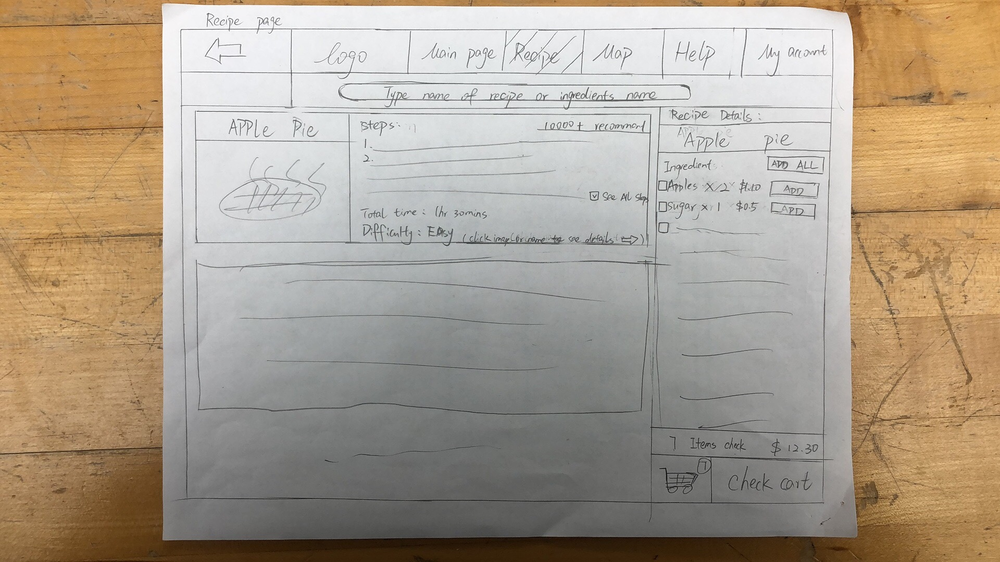
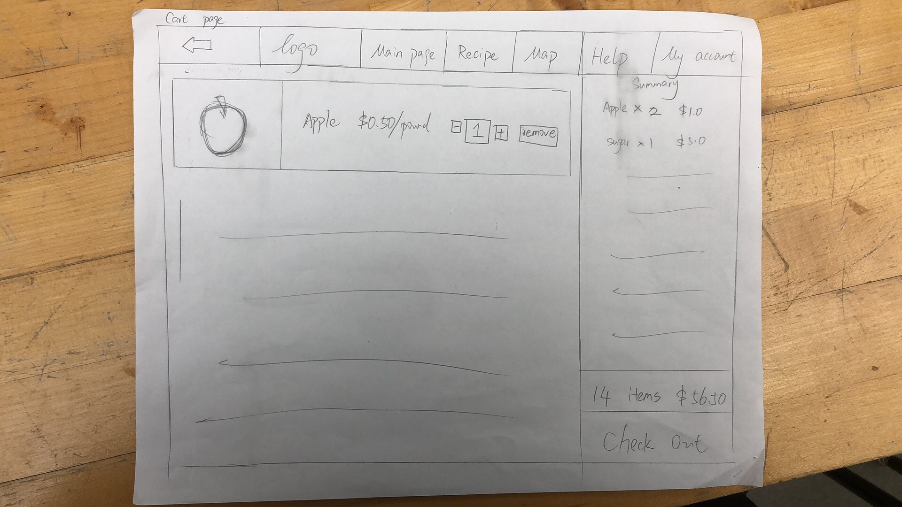

# Part 3 Report and Presentation

## Report

### Problem and Solution Overview:
As America continues to see a growing number of immigrants and an increasing population of ethnic communities there is no denying their impact on American culture. These groups often continue to practice cooking based on traditional recipes and often find it difficult to procure ingredients needed for these recipes. Local ethnic based restaurants are one option but often the cost is too much and missing that authentic taste. Smaller family-owned ethnic stores are often only based in their respected community which for many are not close by. To tackle this problem our group decided to create a website based on two ideas. Idea one focused on the procurement of ingredients through direct purchase through the website. The second one shows local stores with that ingredient in stock and their distance to the user. 
### Initial Paper Prototype:

1. Add all ingredients from recipe to cart
2. Explore recipe by searching for a specific ingredient.

At the left top is the search page for searching ingredients or recipes.
The right top is the cart page which users can check out here.
The left bottom is the item detail page which users could add to cart or link to the related recipe by the right bottom bar.
The right bottom is the recipe page which jump from item page
### Testing Process:
First of all, we have been using the interview survey form, and we will bring the prototype to conduct face-to-face interviews with the participants. We found a total of three participants, the first one was a 23-year-old male, Senior civil Engineer student. The second one is a junior female computer science student from China, while the third one is a senior computer science student also from China. The reason why we chose them is that on the one hand we want to adopt new participants who have never been contacted before and remain objective, and on the other hand we have re-invited two old participants who participated in our interviews in the second part. Initially we tried to explain to the participants and guide them to the next step, but in this case we found that there were some design flaws that would not have been noticed because the participants' attention was distracted by us. Therefore, in the second and third times, we completely left the prototype to the participants to explore on their own. We would only explain to them the functions of the website and the results of their interaction with the website to collect feedback. Since we were making a food website, it was easy for participants to understand and perfect for independent exploration. Therefore, the suggestions given by participants are usually invisible or constructive to us.

###  Testing Result:
In the initial version of the prototype, we took participants on a guided tour of the website, providing explanations and instructions. This approach brought to light some potential design issues, although participants seemed somewhat distracted. Through a heuristic evaluation, we aimed to spot problems related to discoverability, clarity of instructions, and overall user engagement. Simultaneously, usability testing aimed to uncover challenges in user navigation and comprehension.

#####  Learnings:
- Participants may have missed certain design issues due to distractions during guided exploration.
- There are potential problems with discoverability, clarity, and engagement that need attention.
- Usability testing could pinpoint specific pain points in navigation and comprehension.
#####  Changes:
- Refine instructions and guidance to ensure participants stay focused on critical elements by redesigning the cart page so that the information is not too crowded.
- Address discoverability issues by enhancing visual cues and feedback by making the placement of the back button consistent
- Optimize navigation based on usability testing feedback to enhance the overall user experience by making all the tabs visible on each section.
Moving to Version 2, participants were given the freedom to independently explore the prototype, revealing design flaws not noticed during guided sessions. The design critique was employed to analyze overall aesthetics, visual consistency, and alignment with user expectations. Furthermore, user account authentication was requested in addition with systems storing payment methods and delivery address information.
#####  Learnings:
- Independent exploration brought attention to design flaws not noticed during guided sessions.
- Users may face difficulties in tasks related to autonomy, efficiency, and error recovery.
- Usability testing can highlight the effectiveness of participants' exploration and areas needing improvement.
#####  Changes:
- Ensure visual consistency and alignment with user expectations through design critique with more iterative graphics upgrades
- Addition of a log in and a register page for user account authentication. User accounts now also store default delivery address and payment method information.
In Version 3, subsequent versions of the prototype underwent iterative refinement based on user feedback collected during independent exploration.  The heuristic evaluation aimed to uncover issues related to user autonomy, task efficiency, and error recovery. Usability testing provided insights into the effectiveness of participants' independent exploration and identified areas for improvement.
#####  Learnings:
- Continuous feedback collection aids in iterative refinement.
- Design critique helps assess the prototype's aesthetics, visual consistency, and alignment with user expectations.
- Heuristic evaluation and usability testing provide insights into usability and user satisfaction.
##### Changes:
- Optimize the website for user autonomy, ensuring tasks are efficient and error recovery is seamless by providing a help page. 
- Iterative upgrade to the graphics for clearer comprehension of website functions.

#### By combining insights from heuristic evaluation, usability testing, and design critique across different versions, the iterative refinement process aims to create a user-friendly and effective food website, considering both functional and aesthetic aspects.

### Final Paper Prototype:

For our final version of the paper prototype we took the feedback we received from each usability test and produced an overall design that can complete selected tasks and be more user friendly on how to navigate. The main page now includes a top bar that allows the user to track where they are in the website along with a help page that explains how to use the website. User account creation and login adds familiarity to the user and provides a way for the design to remember previous purchases and save items in cart for later. 
#####  Task 1: Finding recipe based on ingredient
Finding a recipe based on an ingredient allows the user to use unfamiliar ingredients with a convenient recipe on our website. The main page now focuses on allowing the user to search for ingredients then the user can go to that ingredient page. From the ingredient page a recommended recipe section was added and can take the user to the full recipe. 

#####  Task 2: Add all ingredients from recipe to cart
Our other task focuses on user convenience that allows the user to add the necessary ingredients for a recipe directly to their cart through one button click.. From there the user can continue their shopping experience and can check out when ready. The added top bar improves where the user can see where they are on the webpage

### Digital Mockup:
For our digital mockup we decided to keep closely to our final paper prototype and improve on how we presented the webpage to the user. Added color to the design helps distinguish exactly where the user is on the webpage. Text and images are more clear with a uniform design that helps the user recognize what ingredients and recipes are being displayed. Our digital mockup is not interactive yet and is going to be a focus for our next iteration. 
##### Task 1: Finding recipe based on ingredient
This task follows the same flow as the paper prototype with starting on the main page to search for an ingredient, then from the ingredient page the recommended recipes displayed in the bottom right can continue to their own page. 

##### Task 2: Add all ingredients from recipe to cart
From the recipe page the user is shown all ingredients needed on the right side on the page. This section allows the user to add and remove each ingredient, along with an add all to cart button. The buttons for this section are a different color to show that they are usable to the user and completes the desired task. 

### Discussion:
Over the course of the project, we have learned how to iterate on a design in a much more streamlined fashion than we had known to do so before. With the results from tests like the heuristic evaluations, we slowly made the design of our website actually work. We learned what we were missing and added things, we took away things that confused users, and we made the design more appealing. This testing and iterating was a process that was not fully known to us and the process was helpful to learn.
Over the course of the usability tests, our design went from a skeleton of a website to something that you could imagine actually using. Each test would give us key information that told us where we made mistakes, and those pieces of information would allow us to make sure not to make the mistakes again upon redesigns. Even if the entire website changed, we could design it in a way that would be more easily usable than the original design had been because of what we learned.
Our tasks, especially, changed in how they were accomplished quite a bit from the original design from the usability tests. In the original site, the only way to find a recipe would be to find an ingredient that the recipe had and look in the suggested recipes, but in new versions there is an entire tab dedicated to searching for recipes. Every piece of the website changed in ways similar to this.
When it comes to the number of iterations we took on our design, I think more could have been useful in some ways. I think one or two iterations after the digital prototype was made could have been useful because that would make sure we brought everything we needed to the digital prototype. When it comes to the paper prototypes, however, I don’t think more iterations would have resulted in much more information being gained. In the last usability test, we really did not gain much new information in comparison to the others, it found nothing wrong with any of the pieces that were implemented previously and only found one issue with the login page that was added after the previous test. I think further testing would have left us with no real important changes.

### Appendix:
#####  Usability Test 1:
Usability Test: Subject 23 Male, Senior civil Engineer student
Explained the general way the paper prototype would work, told a task description and then the user was free to act.
Overall Design:
User is confused on the search bar on the home page, unsure if it is for stores, recipes, ingredients.
1st task: Finding a new recipe.
For the recipe page, the user wants to click the image or name of the recipe to view the full recipe.
The recipe page is missing an option to all the ingredients needed to cart.
The user would like to see ingredients for the recipes.
2nd task: Add all ingredients to cart:
Summary of total cart checkout looks good.
More button on cart is confusing
Would like to filter based on store distance or price
Plus and minus bottom to remove or add an ingredient
##### Usability Test 2:
Explained the general way the paper prototype would work, told a task description and then the user was free to act. Was also allowed to navigate the website to look for any errors from someone who didn’t have as much knowledge.
User 1:
Complained about being unable to see other users reviews in detail
 	
Help and account buttons were unimplemented, these need to be implemented for the last test
 	
User was able to navigate the website pretty easily.

User 2:
1. Terminology used in login page was redundant.
2. Login page had no way to return
Login page top bar was unnecessary

Modifications Made:
Delete top bar for register and login to replace text with welcome instead to remove redundancy.
Add submit on login and added back to login on  the register page.
Added new pages for help, account and reviews.
Delete Go all in item detail pages at recipe bar since it’s unclear.

Contributions:
Jayden: Discussion, Appendix, Problem and solution overview     25%
Jin: Initial Paper Prototype, Testing Process                                   25%
Jimmy: Testing Results                                                                    25%
Marcos: Final Paper Prototype, Digital Mockup                               25%

## Presentation

Embedded below is the presentation for Part 3:

<iframe src="https://docs.google.com/presentation/d/e/2PACX-1vTosxLhIfNQn-UY9BpJOFNkTWjDuqYP3DEiTZ972az6c8P32S4v3-SCC2usKfwI46lo_4Fdk7kn0_vj/embed?start=false&loop=false&delayms=30000" frameborder="0" width="960" height="569" allowfullscreen="true" mozallowfullscreen="true" webkitallowfullscreen="true"></iframe>
